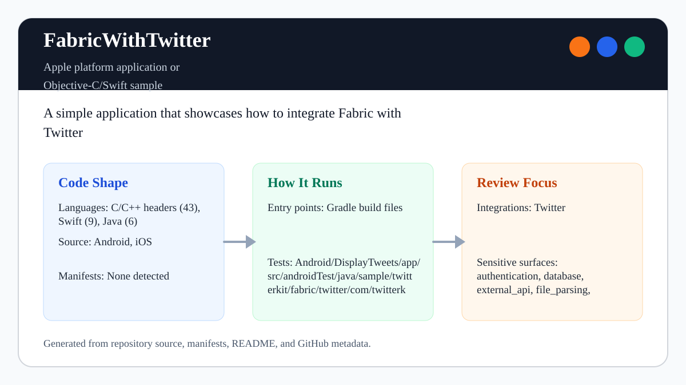

# FabricWithTwitter

<!-- README-OVERVIEW-IMAGE -->


## Overview

`garethpaul/FabricWithTwitter` contains legacy Android, Wear, iOS, and watchOS
samples showing how the retired Fabric and TwitterKit SDKs were integrated.

For a capability-by-capability replacement map covering Firebase Crashlytics,
X OAuth and API access, browser fallback, and the current Wear OS Data Layer,
see `docs/modern-platform-alternatives.md`. The guide is planning material and
does not claim that these historical samples have been migrated.

The portable Make gate compiles and executes the production iOS tweet permalink
policy when `swiftc` is available. This proves the deterministic URL allowlist
without claiming TwitterKit, simulator/device, live-service, Android, Wear, or
template XCTest execution.

This README is based on the checked-in source, manifests, scripts, and
repository metadata on the `master` branch. The repository mixes Java, Swift,
Gradle, Xcode projects, shell verification, and vendored historical frameworks.

## Repository Contents

- `README.md` - project overview and local usage notes
- `Android` - source or example code
- `Makefile` and `scripts/check-baseline.sh` - static maintenance checks
- `iOS` - source or example code
- `SECURITY.md` - security reporting and disclosure guidance
- `VISION.md` - project direction and maintenance guardrails

Additional scan context:

- Source directories: Android, iOS
- Dependency and build manifests: Android Gradle projects and iOS Xcode projects
- Entry points or build surfaces: Gradle build files and `.xcodeproj` files
- Test-looking files: Android/DisplayTweets/app/src/androidTest/java/sample/twitterkit/fabric/twitter/com/twitterkit/ApplicationTest.java, Android/WearExample/mobile/src/androidTest/java/samples/twitterkit/fabric/twitter/com/wearexample/ApplicationTest.java, iOS/TableViewTweetsSwift/TableViewTweetsSwiftTests/Info.plist, iOS/TableViewTweetsSwift/TableViewTweetsSwiftTests/TableViewTweetsSwiftTests.swift, iOS/WatchSample/WatchSampleTests/Info.plist, iOS/WatchSample/WatchSampleTests/WatchSampleTests.swift

## Getting Started

### Prerequisites

- Git
- macOS with Xcode for building Apple platform projects

### Setup

```bash
git clone https://github.com/garethpaul/FabricWithTwitter.git
cd FabricWithTwitter
```

The setup commands above are derived from repository files. Legacy mobile, Python, or JavaScript samples may require older SDKs or package versions than a modern workstation uses by default.

## Running or Using the Project

- Use Android Studio to open the project or run `gradle assembleDebug` when the Android SDK is configured.
- Android legacy dependency pins remove dynamic selectors while preserving the
  original Gradle, SDK, Fabric, TwitterKit, and Wear API generations.
- The checked-in Android wrapper JARs are pinned to the reviewed Gradle v2.1
  source artifact. Before any legacy wrapper execution, independently verify
  the downloaded `gradle-2.1-all.zip` SHA-256 documented by the provenance
  checker; CI does not execute these retired builds.
- Open the Xcode project or workspace in Xcode and run the matching app/sample scheme.
- Configure `FABRIC_API_KEY` and `FABRIC_BUILD_SECRET` in local Gradle/Xcode
  environment settings when exercising Fabric upload behavior. The checked-in
  iOS build phases skip Fabric upload when those variables are absent.
- The TableView iOS sample keeps `FABRIC_API_KEY`, `TWITTER_CONSUMER_KEY`, and
  `TWITTER_CONSUMER_SECRET` as inert build-setting placeholders in its tracked
  plist. Copy `Config/LocalSecrets.xcconfig.example` to the ignored
  `Config/LocalSecrets.xcconfig`, add only tester-owned authorized values, and
  pass it locally with `xcodebuild -xcconfig Config/LocalSecrets.xcconfig ...`.
  Do not commit the populated file or include its contents in logs or evidence.
- Android manifests keep `com.crashlytics.ApiKey` empty in source; populate
  real values through local Fabric tooling or local build configuration only.

## Testing and Verification

Run the static maintenance baseline:

```bash
make check
```

The baseline verifies that committed iOS Fabric run scripts use local
environment variables, Android Crashlytics manifest keys remain placeholders,
raw tweet/error display logs are avoided, Wear message paths are not logged,
Wear message payloads are encoded and decoded as UTF-8, blank Wear tweet text
is skipped before sending and display, unsupported control characters are
rejected, Wear notification display targets are
checked before setting tweet text, the notification detail activity is
internal-only and has no launcher filter, the Wear listener is explicitly
exported only for the system's `BIND_LISTENER` action, Wear mobile login button
handling is null-safe, Wear mobile tweet display verifies that its container
view exists before adding a `TweetView`, delayed callbacks cannot reconnect the
Wear client or update UI after the mobile activity is destroyed, local
DisplayTweets callbacks cannot add compact tweet views after their activity is
destroyed, local
credential files stay ignored, and Xcode project listing is attempted when
`xcodebuild` is installed.

The `make lint`, `make test`, and `make build` aliases run the same static
baseline while these legacy samples have no narrower installed gates here.
GitHub Actions installs a checksum-pinned Gitleaks release and runs
`make security` on macOS for pushes and pull requests, including hostile
credential fixtures and Xcode project parsing without requiring credentials or
persisting checkout credentials.

The focused host gates also execute the tweet permalink policy and the pure
Java Wear message/PendingIntent policy when their compilers are available, and
verify both Gradle wrapper JARs without executing them.

For functional verification, follow
[`docs/manual-sample-verification.md`](docs/manual-sample-verification.md) and
record Android DisplayTweets, Wear mobile/listener, iOS TableView, and iOS
WatchSample results separately. The matrix was not executed by this Linux
maintenance session; hosted Xcode project listing is not runtime proof.

When the required SDK or runtime is unavailable, use static checks and source review first, then verify on a machine that has the matching platform toolchain.

## Configuration and Secrets

- Detected references to Twitter. Keep API keys, OAuth credentials, tokens, and account-specific values in local configuration only.
- Keep `FABRIC_API_KEY`, `FABRIC_BUILD_SECRET`, Twitter keys/tokens, Android
  keystores, signing identities, `.env`, and `.xcconfig` files out of source
  control.
- A build with unset TableView credential settings is intentionally inert; do
  not replace the tracked placeholders with literal values to make it run.
- Historical Fabric/Twitter credentials were committed publicly. They must be
  treated as compromised and revoked or deleted in the provider dashboards;
  see [`docs/credential-incident-response.md`](docs/credential-incident-response.md).
- Do not log raw tweet objects, Twitter exception messages, or account-specific
  display data from sample apps.
- Do not log raw Wear message paths or payloads; keep cross-device diagnostics
  generic.
- Wear tweet loading skips missing, empty, or whitespace-only tweet text before
  sending messages to the watch or displaying watch notifications.
- Wear tweet messages reject UTF-8 payloads over 1024 bytes before transport or
  listener decoding, and the listener rejects malformed UTF-8 instead of
  displaying replacement characters.
- Wear tweet payloads reject Unicode bidi controls while preserving zero-width-joiner text.
- Wear notification display verifies that the text view target exists before
  setting tweet text.
- Reused Wear notification intents refresh their tweet extra before display so
  tapping a later notification does not reopen stale content, and are immutable
  on API 23 and newer.
- See `docs/manual-sample-verification.md` for per-sample toolchain, build,
  runtime, privacy, destructive-watch-action, cleanup, and evidence boundaries.
- The Wear listener service is explicitly exported only for Google Play
  Services binding and exposes only the Wear `BIND_LISTENER` action.
- The Android Wear mobile sample forwards Twitter login activity results only
  when the login button view was initialized.
- The Android Wear mobile sample verifies that the tweet display container
  exists before adding a TwitterKit `TweetView`.
- The Android Wear mobile sample rejects delayed login, tweet, and message work
  after activity destruction and disconnects a client if destruction races a
  blocking reconnect. Node lookup and every node send recheck destruction so
  work already past reconnect cannot start a new send after teardown begins.
- Keep mobile-to-watch tweet message bytes explicitly encoded as UTF-8 so the
  watch listener decodes the same contract.
- The iOS TableView sample clears its tweet-loading in-flight flag after guest
  login failure or tweet-load completion so refreshes are not permanently
  blocked.
- The iOS TableView sample type-checks loaded TwitterKit objects and replaces
  visible rows atomically so malformed responses cannot crash or duplicate rows.
- The iOS TableView sample publishes TwitterKit callback state and table updates
  only on the main queue.
- The iOS TableView sample requires a credential-free HTTPS permalink on
  canonical Twitter and X hosts with no explicit port before opening a selected
  tweet; exact matching rejects subdomains and suffix lookalikes, while the
  path accepts only ASCII handles and status IDs.

## Security and Privacy Notes

- Review changes touching authentication or token handling; examples from the scan include iOS/TableViewTweetsSwift/TableViewTweetsSwift/ViewController.swift, iOS/TableViewTweetsSwift/TwitterKit.framework/Versions/A/Headers/DGTAuthenticateButton.h, iOS/TableViewTweetsSwift/TwitterKit.framework/Versions/A/Headers/DGTSession.h, iOS/TableViewTweetsSwift/TwitterKit.framework/Versions/A/Headers/Digits.h, and 6 more.
- Review changes touching external API calls or credential-adjacent configuration; examples from the scan include Android/DisplayTweets/app/build.gradle, Android/DisplayTweets/app/src/androidTest/java/sample/twitterkit/fabric/twitter/com/twitterkit/ApplicationTest.java, Android/DisplayTweets/app/src/main/AndroidManifest.xml, Android/DisplayTweets/app/src/main/java/sample/twitterkit/fabric/twitter/com/twitterkit/MainActivity.java, and 6 more.
- Review changes touching network requests, sockets, or service endpoints; examples from the scan include Android/DisplayTweets/app/build.gradle, Android/DisplayTweets/app/src/androidTest/java/sample/twitterkit/fabric/twitter/com/twitterkit/ApplicationTest.java, Android/DisplayTweets/app/src/main/AndroidManifest.xml, Android/DisplayTweets/app/src/main/res/layout/activity_main.xml, and 6 more.
- Review changes touching mobile permissions or privacy-sensitive device data; examples from the scan include Android/DisplayTweets/app/src/main/AndroidManifest.xml, Android/DisplayTweets/gradlew, Android/WearExample/gradlew, Android/WearExample/mobile/src/main/AndroidManifest.xml, and 2 more.
- Review changes touching file, media, JSON, XML, CSV, OCR, or data parsing; examples from the scan include Android/DisplayTweets/app/src/main/AndroidManifest.xml, Android/DisplayTweets/app/src/main/java/sample/twitterkit/fabric/twitter/com/twitterkit/MainActivity.java, Android/DisplayTweets/app/src/main/res/values/strings.xml, Android/DisplayTweets/app/src/main/res/values-v21/styles.xml, and 6 more.
- Review changes touching database, model, or persistence code; examples from the scan include iOS/TableViewTweetsSwift/TableViewTweetsSwift/ViewController.swift, iOS/TableViewTweetsSwift/TwitterKit.framework/Versions/A/Headers/TWTRTweetTableViewCell.h, iOS/TableViewTweetsSwift/TwitterKit.framework/Versions/A/Headers/TWTRTweetViewDelegate.h, iOS/WatchSample/TwitterKit.framework/Versions/A/Headers/TWTRTweetTableViewCell.h, and 1 more.

## Maintenance Notes

- Use `docs/modern-platform-alternatives.md` before proposing SDK replacement.
  It separates crash reporting, authentication, content lookup, and Wear
  transport into independently verifiable stages and links current primary
  provider documentation.
- This looks like an Apple platform project or sample. Xcode, Swift, CocoaPods, and deployment target versions may need to match the original project era.
- Run `make check` before pushing changes to Android manifests, Xcode project
  files, Fabric/Twitter integration, or credential handling.
- The full gate can run through an absolute Makefile path from another working
  directory: `make -f /path/to/FabricWithTwitter/Makefile check`.
- Android display, mobile, and wear samples keep `android:allowBackup="false"`
  so app data is not opted into platform backup by default.
- See `SECURITY.md` for vulnerability reporting and safe research guidance.
- See `VISION.md` for project direction and contribution guardrails.
- See `docs/plans/2026-06-09-wear-tweet-payload-guard.md` for the Wear tweet
  payload guard.
- See `docs/plans/2026-06-13-wear-message-payload-limit.md` for the cross-device
  tweet payload byte limit.
- See `docs/plans/2026-06-09-wear-login-button-guard.md` for the Wear mobile
  Twitter login button lifecycle guard.
- See `docs/plans/2026-06-09-wear-notification-text-view-guard.md` for the Wear
  notification display target guard.
- See `docs/plans/2026-06-09-android-backup-opt-out.md` for the Android backup
  opt-out guard.
- See `docs/plans/2026-06-09-wear-tweet-view-container-guard.md` for the Wear
  mobile tweet display container guard.
- See `docs/plans/2026-06-10-ci-baseline.md` for the hosted GitHub Actions
  baseline.
- See `docs/plans/2026-06-15-ios-twitter-permalink-host-boundary.md` for the
  exact iOS Twitter/X navigation host boundary.

## Contributing

Keep changes small and tied to the project that is already present in this repository. For code changes, document the toolchain used, avoid committing generated dependency directories or local configuration, and update this README when setup or verification steps change.
